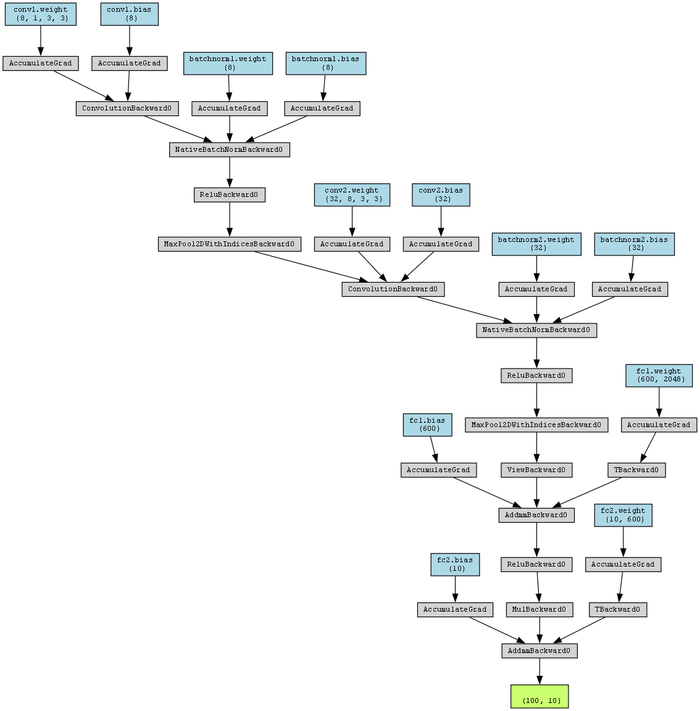

# Digit Recognition Dashboard using Streamlit and PyTorch

## Overview

This project uses the PyTorch framework and the MNIST dataset to demonstrate the use of a convolutional neural network (CNN) for digit recognition. The model has been trained to recognize handwritten numbers ranging from 0 to 9. The trained model is then wrapped in a dashboard created with the Streamlit framework to allow for easy user interaction.

  

## Dependencies

 - PyTorch

- Torchvision

- Streamlit

- Numpy

- Seaborn and Matplotlib (for visualizing results)

## Usage

 1. Clone the repository:

`git clone https://github.com/mehmet-nabi-duru/digit-recognition-dashboard-pytorch-streamlit.git`

2. Install the required dependencies.

3. Run the app.py file:

`streamlit run app.py`

## Model Training

The MNIST dataset is used to train the convolutional neural network model, which contains 60,000 training photos and 10,000 test images of handwritten digits. The following are the steps in the training process:

- Loading and normalizing the MNIST training and test datasets using torchvision

- Defining the CNN architecture

- Defining the loss function and optimizer

- Training the model on the training dataset for a specified number of epochs

- Testing the model on the test dataset

The trained model is then saved as a .pth file in the models directory.

  

## Dashboard

The dashboard built with Streamlit allows the user to easily interact with the trained model. The user can upload an image of a handwritten digit, and the model will predict the digit. The dashboard also displays the probability of the prediction being correct.

  

## Results

The trained model was able to achieve an accuracy of 99% on the test dataset. The model can recognize handwritten digits with a high degree of accuracy.

  

## Conclusion

This project demonstrates the use of CNNs for digit recognition using the PyTorch framework and the MNIST dataset. The trained model is wrapped in a user-friendly dashboard built with Streamlit for easy interaction with the user. This can be used as a starting point for other projects involving image recognition and creating interactive dashboards.
